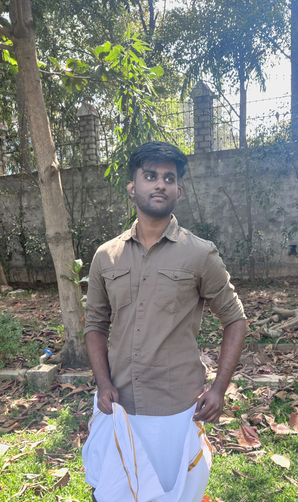

---
# the default layout is 'page'
icon: fas fa-info-circle
order: 4
---

I'm Beniel Immanuel, Graduate student in Computational Data Science at [UC Riverside](https://www.ucr.edu/) with expertise in data visualization, and environmental analysis. Proficient in Python, SQL, and Java with a year of research experience in Machine Learning. 

I graduated from The [VIT VELLORE, INDIA](https://vit.ac.in/), with a bachelor's degree in Electrical engineering.

In my free time, I play blackjack (Hitting at 17 works...trust me) & hit the gym no pun intended.

{: w="600" h="350" }

Me wearing my Dhoti for [Pongal](https://en.wikipedia.org/wiki/Pongal_(festival))!!

I’m best reached through [LinkedIn](https://www.linkedin.com/in/beniel-immanuel/). I’m always open to interesting conversations and collaboration.